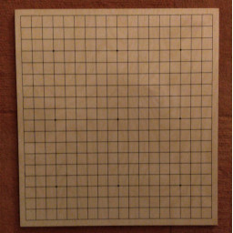
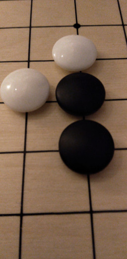
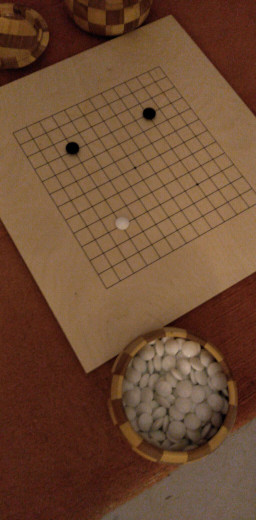
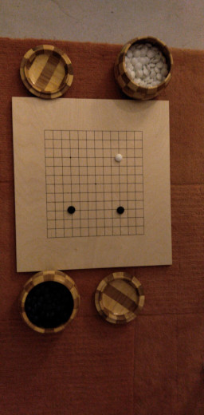
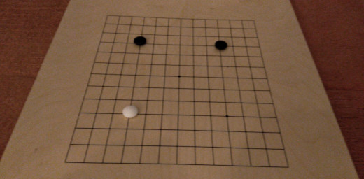

# Board parser
Given an image, this library finds a go board and identifies a position of each
stone in the lattice.



There are several sizes of boards. Most commons are **9x9**, **13x13** and
**19x19**. In the example above, the board is 19x19. What matters on a go board
are the lines and their intersections. We can annotate these intersections from
top left corner to the bottom right by incrementing numbers. For example, a
fourth intersection on the second row on a 19x19 board is annotated as
19 + 19 + 4 = **42**. An alternative annotation would be `row:column`, e. g.
`2:4`.

The stones are places on the intersections. There are two players in go. A move
is placement of a player's coloured stone on the go board, i. e. one player puts
down only black stones and the other only white stones. Black and white stones
are the most common type of stone.



## Assumptions
- There are only 9x9, 13x13 and 19x19 boards.
- The stones are black and white.
- Each intersection is equally spaced from the others.
- Good light conditions.
- The whole board is shown on the camera.
- The board is not empty.

## Requirements
We need to analyse pictures and find boards in them. If a board is found, we
need to be able to say which pixels roughly corresponds to top left and bottom
right corners of the board. For each intersection on the board, we need to tell
whether there's a white stone, a black stone or neither.

The algorithm needs to be able to output this information for boards which are
arbitrarily rotated.



The algorithm needs to be able to ignore other accessories that might be on the
photo but is not related to the board.



There needs to be some give in the angle under which the photo is taken. Ideally
the board would be viewed from angle 90deg.



## Testing
During development we use pictures we took of the go board and evaluate the
algorithm against them. To bench mark an algorithm, we can take a picture of an
empty board from several angles and generate many different board
constellations. We can then use this data set to validate that the algorithm
yields satisfying results.

## Approaches
### Contrast highlighting and finding elliptical objects
We focus on the fact that the stones are going to be black and white. Therefore
we can rule out pixels which are coloured. We now have a picture which contains
black stones, white stones, board lines and noise. To rule out noise, we can
leverage the shape of the stones. Depending on the point of view, they're going
to be either elliptical or circular. We attempt to find objects which are
approximated by the equation of ellipsis.

```
(x^2)   (y^2)
----- + ----- = 1
  a       b
```

Once we have found some objects which are identified by this equation and their
`a`, `b` and size match, we can calculate the distances between them to identify
more stones. Eventually, we will have identified enough stones to be able to say
what's the spacing between the intersections.
